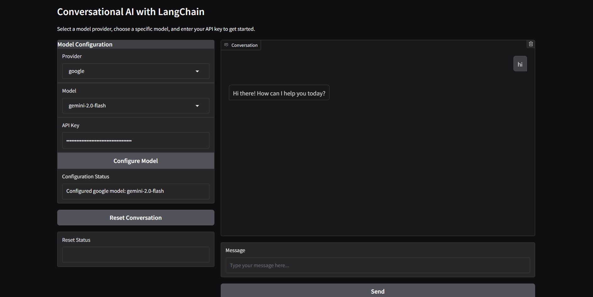

# Conversational AI Application

A modular conversational AI application that allows users to interact with different language models (OpenAI, Anthropic Claude, Google Gemini) through a clean user interface.

## Features

- **Multiple LLM Support**: Seamlessly switch between OpenAI, Anthropic Claude, and Google Gemini models
- **API Key Management**: Enter and manage API keys for all providers in one place
- **Streaming Responses**: Real-time, token-by-token responses for a more interactive experience
- **System Prompts**: Customize the AI's behavior with custom system instructions
- **Conversation History**: Maintain and reset conversation context as needed
- **Modern UI**: Clean, responsive interface built with Gradio

## Architecture

This application follows a client-server architecture:

- **Frontend**: Gradio-based UI for user interaction
- **Backend**: FastAPI server that orchestrates LLM communication
- **Integration**: LangChain for unified access to various LLM providers

## Prerequisites

- Python 3.9+ 
- API keys for the LLM providers you want to use:
  - [OpenAI API Key](https://platform.openai.com/account/api-keys)
  - [Anthropic API Key](https://console.anthropic.com/account/keys)
  - [Google Gemini API Key](https://makersuite.google.com/app/apikey)

## Installation

1. Clone the repository:
   ```bash
   git clone [https://github.com/vinayak20130/conversational-ai-assignment.git](https://github.com/vinayak20130/conversational-ai/)
   ```

2. Create and activate a virtual environment:
   ```bash
   # Windows
   python -m venv venv
   venv\Scripts\activate

   # macOS/Linux
   python -m venv venv
   source venv/bin/activate
   ```

3. Install dependencies:
   ```bash
   pip install -r requirements.txt
   ```

4. (Optional) Set up environment variables:
   - Create a `.env` file in the root directory
   - Add your API keys (see `.env.example`)

## Running the Application

1. Start the backend server:
   ```bash
   # From the project root directory
   cd backend
   uvicorn app:app --reload --host 0.0.0.0 --port 8000
   ```

2. In a separate terminal, start the frontend:
   ```bash
   # From the project root directory
   cd frontend
   python app.py
   ```

3. Open your browser and navigate to the URL shown in the Gradio terminal (typically http://localhost:7860)

## Usage

1. **Enter API Keys**: Input your API keys for the LLM providers you want to use
2. **Select a Provider and Model**: Choose which AI model you want to chat with
3. **Configure Model**: Click "Configure Selected Model" to set up the chat
4. **Start Chatting**: Type your message and press Enter or click "Send Message"
5. **Customize Behavior**: (Optional) Add system prompts to guide the AI's responses
6. **Reset Conversation**: Clear the conversation history when needed

## API Endpoints

The backend exposes the following endpoints:

- `GET /api/models`: Get available model providers and models
- `POST /api/configure`: Configure the model for a session
- `POST /api/chat`: Generate a response to a chat message (non-streaming)
- `POST /api/chat/stream`: Generate a streaming response
- `POST /api/reset`: Reset a conversation

## Project Structure

```
conversational-ai/
├── backend/
│   ├── app.py                # FastAPI main application
│   ├── config.py             # Configuration settings
│   ├── models/
│   │   ├── __init__.py
│   │   ├── llm_factory.py    # Factory for creating LLM instances
│   │   └── model_config.py   # Model configuration classes
│   ├── routers/
│   │   ├── __init__.py
│   │   └── chat.py           # Chat endpoints
│   └── services/
│       ├── __init__.py
│       └── conversation.py   # Conversation management service
├── frontend/
│   └── app.py                # Gradio UI
├── .env.example              # Example environment variables
├── requirements.txt          # Project dependencies
└── README.md                 # This file
```

## Customization

### Adding New Models

To add support for new models:

1. Update the `AVAILABLE_MODELS` dictionary in `backend/config.py`
2. Add appropriate configuration in `backend/models/llm_factory.py`

### Extending the API

To add new endpoints:

1. Create new route handlers in the appropriate files in `backend/routers/`
2. Update the frontend to use the new endpoints

## Troubleshooting

**API connection issues:**
- Verify your API keys are correct
- Check that your internet connection is stable
- Ensure you've selected a valid model for the provider

**Backend errors:**
- Check the terminal running the backend for error messages
- Verify that all dependencies are installed correctly

**Frontend issues:**
- Clear your browser cache
- Check the browser console for errors

## License

[MIT License](LICENSE)

## Acknowledgments

- [LangChain](https://github.com/langchain-ai/langchain) for the LLM integration framework
- [FastAPI](https://fastapi.tiangolo.com/) for the backend framework
- [Gradio](https://gradio.app/) for the frontend UI components
